# 02 - Boss of the SOC (BOTS) v1 - Cerber Ransomware Investigation with Sigma Rules, Process Lineage and MITRE ATT&CK analysis

## Overview

This documents an investigation into a Cerber ransomware attack targeting Bob Smith's workstation (`we8105desk`) at Wayne Enterprises. The attack involved an initial infection via a malicious macro document, VBScript execution, lateral movement to a file server, and full file encryption. All activity was investigated using Splunk with data sources including Suricata IDS, Fortigate firewall, Sysmon, WinRegistry, and WinSecurity logs. This investigation required much deeper analysis/triaging than the batman web server investigation, so write-ups for my thought processes and answers were more lengthy. 

## Context:

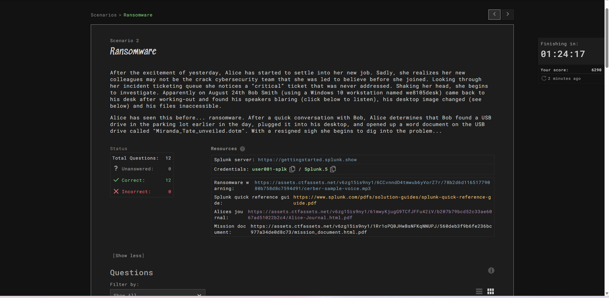


## Lab Environment

| Role | Details |
|------|---------|
| SIEM | Splunk (BOTS v1 dataset) |
| Victim Workstation | we8105desk (192.168.250.100) |
| Victim User | Bob Smith (bob.smith) |
| File Server | we9041srv |
| Initial Infection Vector | Miranda_Tate_unveiled.dotm (via USB) |
| Malware Family | Cerber Ransomware |

**Data Sources Used:** Suricata, Fortigate (fgt_utm), XmlWinEventLog:Microsoft-Windows-Sysmon/Operational, WinRegistry, stream:dns
---
<br>

# Process Lineage & MITRE ATT&CK Analysis

## Process Lineage

The Cerber ransomware attack followed a suspicious parent-child process chain that is highly indicative of malware execution and script-based payload delivery.

```text

WINWORD.EXE  (Miranda_Tate_unveiled.dotm opened from USB)
└── CMD.EXE
    └── WSCRIPT.EXE
        └── 121214.tmp
            ├── HTTP GET - solidaritedeproximite.org
            │       └── mhtr.jpg downloaded (steganography-encoded cryptor)
            ├── SMB/NetBIOS - 192.168.250.20 (we9041srv)
            │       └── 257 PDFs encrypted on remote file server
            ├── Local file encryption
            │       └── 406 .txt files encrypted in bob.smith profile
            │           EventCode 2 (timestomp) on all affected files
            └── DNS beacon - cerberhhyed5frqa.xmfir0.win
                    └── Post-encryption C2 callback (1.688s after encryption)
````

This process lineage is particularly suspicious because Microsoft Office applications do not normally spawn command interpreters (`cmd.exe`) or scripting engines (`wscript.exe`) during legitimate business activity.

The large `ParentCommandLine` field identified in Question 5 (4490 characters) also suggests possible script obfuscation or encoded payload execution.

---

## MITRE ATT&CK Mapping

| Attack Activity | MITRE Technique | ID        |
| --------------- | --------------- | --------- |
| USB-delivered infection vector | Replication Through Removable Media | T1091 |
| User opens malicious `.dotm` document | User Execution: Malicious File | T1204.002 |
| Macro/VBScript execution | Visual Basic | T1059.005 |
| cmd.exe spawned by WINWORD.EXE to initiate attack chain | Command and Scripting Interpreter: Windows Command Shell | T1059.003 |
| Large obfuscated VBScript execution | Obfuscated Files or Information | T1027 |
| Malware execution through trusted Windows binaries | Signed Binary Proxy Execution | T1218 |
| Download of `mhtr.jpg` payload | Ingress Tool Transfer | T1105 |
| Hidden payload inside `.jpg` | Steganography | T1027.003 |
| SMB/NetBIOS communication with file server | SMB/Windows Admin Shares | T1021.002 |
| Encryption of local and remote files | Data Encrypted for Impact | T1486 |
| Post-encryption callback to Cerber infrastructre | Application Layer Protocol | T1071 |

---
<br>

## Detection Opportunities

Several strong behavioral indicators were identified during the investigation that rules could potentially detect:

- Rule: Alert when any Office application (winword.exe, excel.exe) spawns cmd.exe or wscript.exe: should almost never happen 
- Rule: Alert on .tmp files being executed as processes (execution of temp-directory payloads): .tmp files should not be in execution paths
- Rule: Flag processes with ParentCommandLine length exceeding 1000 characters: Potential encoded/obfuscated script execution
- Rule: Alert on SMB write volume spikes from a single workstation to a file server within a short time window: highly unusual to be modifying that many files on file server in short time span
- Rule: Alert when a burst of file modification events is immediately followed by creation of a file matching *DECRYPT* or *README* in the same directory: sign files have been encrypted
- Rule: Alert on DNS requests to external domains within 5 seconds of a mass file modification event: Should never happen together - redirect to malicious web server shows potential post-encryption details being sent in ransomware attack

**See "BOTS v1 - Ransomware Attack Investigation/Sigma_Rules_Ransomware.md" for official sigma rules written for investigation**

---

## Attack Timeline Summary

| Time (24AUG2016) | Event |
|------------------|-------|
| ~16:43 | USB (`MIRANDA_PRI`) plugged in; `Miranda_Tate_unveiled.dotm` opened |
| 16:43:21 | VBScript executed via `cmd.exe` - `Wscript.exe` (ParentProcessId: 3968) - launches `121214.tmp` |
| 16:48:12 | First malicious DNS request to `solidaritedeproximite.org`; `mhtr.jpg` downloaded (contains cryptor via steganography) |
| 17:15:11 | Encryption phase complete; `DECRYPT MY FILES #.txt` created |
| 17:15:13 | DNS request to `cerberhhyed5frqa.xmfir0.win` (1.688s after encryption) |


## Key Indicators of Compromise (IOCs)

| Indicator | Value |
|-----------|-------|
| Victim workstation | we8105desk (192.168.250.100) |
| File server | we9041srv (192.168.250.20) |
| USB device name | MIRANDA_PRI |
| Initial infection file | Miranda_Tate_unveiled.dotm |
| Downloaded payload | mhtr.jpg (steganographically encoded cryptor) |
| Ransomware executable | 121214.tmp |
| First malicious domain | solidaritedeproximite.org |
| Post-encryption C2 domain | cerberhhyed5frqa.xmfir0.win |
| .txt files encrypted (local) | 406 |
| PDFs encrypted (file server) | 257 |

---
<br>

## Detection Summary:

The investigation revealed a multi-stage ransomware attack against Wayne Enterprises. Bob Smith's workstation was compromised via a malicious macro document delivered on a USB drive. The document executed a VBScript payload through a cmd.exe to wscript.exe process chain, which launched the Cerber ransomware binary (121214.tmp). The malware downloaded its cryptor code from a flagged French server (solidaritedeproximite.org) disguised inside a .jpg file using steganography, then laterally accessed the file server (we9041srv) over SMB before encrypting 406 local .txt files and 257 remote PDFs. The attack concluded with a DNS beacon to the Cerber C2 infrastructure 1.688 seconds after encryption completed.

## Investigation:

### Q1: What was the most likely IPv4 address of we8105desk on 24AUG2016?

**Answer: `192.168.250.100`**

The first thing I did was change the date range in the top right to the spanning from beginning of august 24th 2016 to the end of august 25th 2016. Obviously I want to see where the host was we8105desk and what the src_ip was associated with each one. On top of that, we are now dealing with windows OS and files rather than a webserver attack, so it would help to filter to a network transmission or some kind of communication for the IP to be stated in an event. Querything this, found that there were an overwhelming amount of 192.168.250.100 compared to the other source IPs, which is typical for a workstation to have many more outgoing requests/connections than inbound.
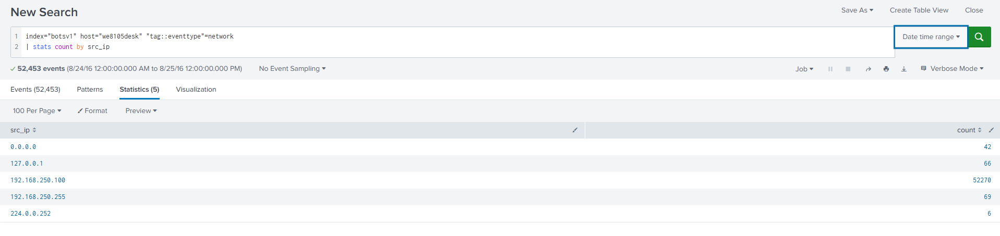

To confirm, analyzing one of the specific logs shows the IP of 192.168.250.100 for the host of we8105desk.
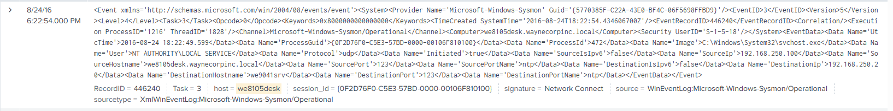


---
<br>

### Q2: Amongst the Suricata signatures that detected the Cerber malware, which one alerted the fewest number of times? Submit ONLY the signature ID value as the answer.

**Answer: `2816763`**

So for this one I first just queried results including cerber, and the sourcetype of suricata. Then I saw on the side bar there was an alert.signature_id which is exactly what we wanted to answer this question, so I sorted the number of signature occurrences and found that 2816763 was the least occurring alert with only 1.
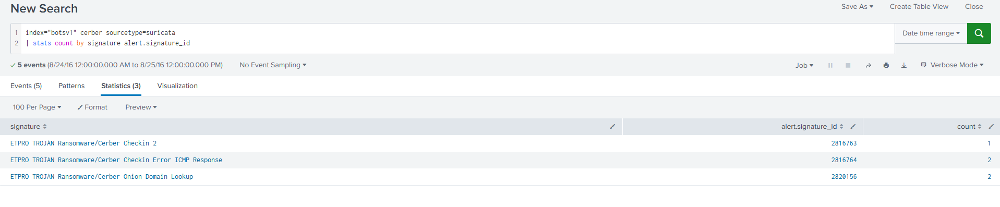

---
<br>

### Q3: What fully qualified domain name (FQDN) does the Cerber ransomware attempt to direct the user to at the end of its encryption phase?

**Answer: `cerberhhyed5frqa.xmfir0.win`**

In the intro context given (audio file), we know that Bob's files are all inaccessible and the recording states that all of his "documents, databases, photos, and other important files" have been encrypted. We want to find the time that the files were encrypted, so assuming the attacker didn't gain admin privileges before encrypting anything, we can query under Bob's user account on his host machine for Sysmon files with the event codes 1, 11, or 21. 1 for process creation if attacker opened another app to aid in the attack, 11 if the attacker created new files to place the encrypted info in, or modified the files to overwrite the original info with the encrypted info in original file, and 21 for if he deleted any of Bob's files. After filtering further with ".txt" luckily we did find an encrypted file in an event with a code 1 as we can see: "DECRYPT MY FILES #.txt". at 5:15:11.000 PM.
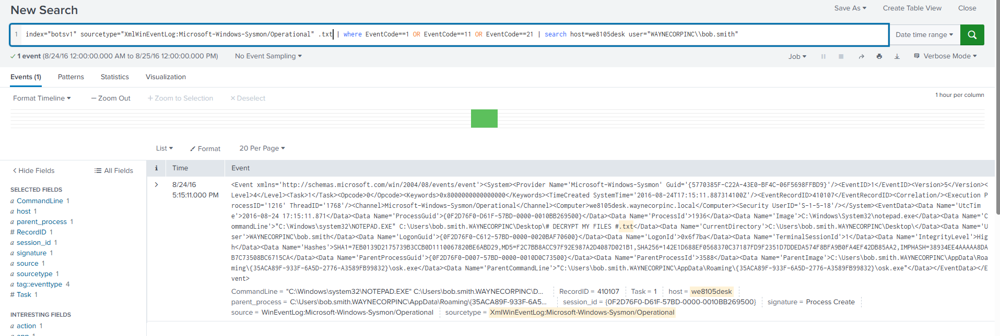

Now filtering the time range to after 5:15:11.000 PM, we can search for dns request from Bob's host machine. Since we know this is will be a DNS request resolving a domain name to IP4, adding `tag::eventtype=dns` as well as `record_type=A` helps us to narrow down the results. 
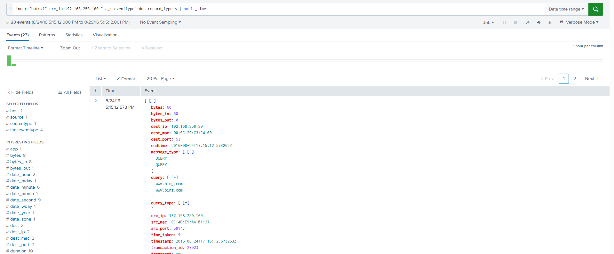

Sorting the events to start immediately after the files were encrypted, we see a suspicious domain name in a request in the second listed event just 1.688 seconds after the file encryption. It's safe to assume that this is the domain cerber malware is attempting to direct the user to at the end of the encryption phase: `cerberhhyed5frqa.xmfir0.win`
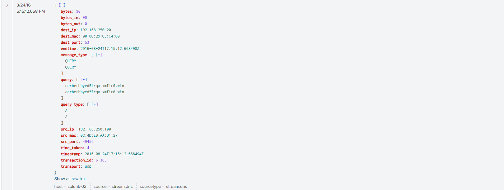

---
<br>

### Q4: What was the first suspicious domain visited by we8105desk on 24AUG2016?

**Answer: `solidaritedeproximite.org`**

For this the first thing I did was change the date/time range back to the very beginning of August 24th 2016, then queried very similarly to #3 with `tag::eventtype=dns record_type=A` from Bob's infected machine, still including `sort _time` because we want to find the first malicious domain visited that day. It returned 43 events but I'm not seeing anything malicious yet, going to quickly filter the query down further to prioritize results that don't have traditional trustworthy domain extensions (.com, .local & .net to start).
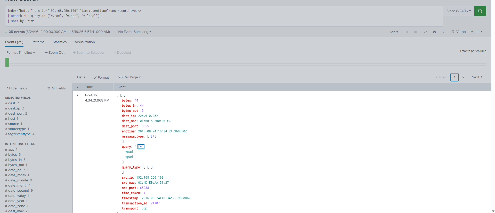

The first few are just WPAD (web proxy auto discovery) and Microsoft domains, which we know shouldn't be malicious. Then at 16:48:12.267 we see a domain called `solidaritedeproximite.org.` 
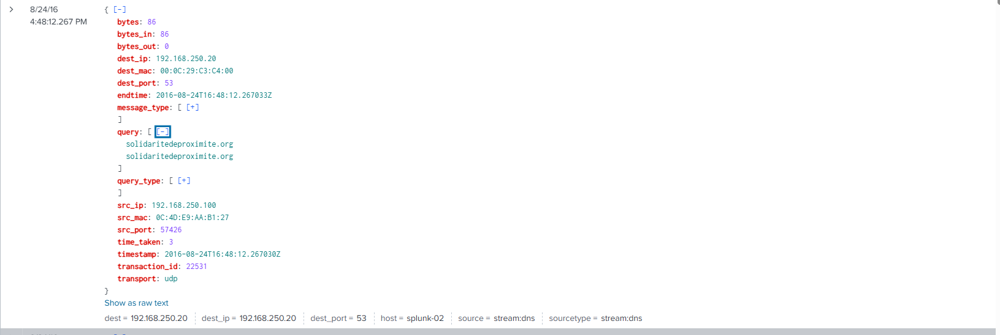

When doing a little more digging into the GET requests to the server, we see it appears to be a French-located server, or at least written in French, which is pretty unusual for a host machine at wayne enterprises to be sending requests to.
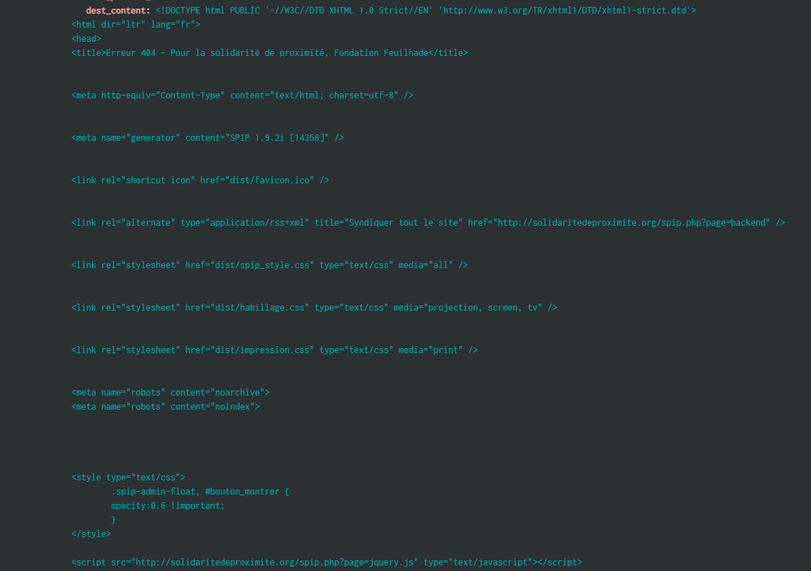

Changing the sourcetype to fortigate logs (fgt_utm), we can see that the server is indeed located in France , which is a big red flag, and we see something even more important confirming suspicions: that fortigate has flagged this as a domain from its honeypot-access list, meaning it's been associated with malicious activity and flagged in the past. This definitely appears to be the first malicious FQDN that we8105desk visited that day.
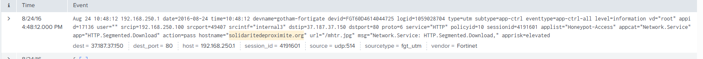

---
<br>

### Q5: During the initial Cerber infection a VB script is run. The entire script from this execution, pre-pended by the name of the launching .exe, can be found in a field in Splunk. What is the length of the value of this field?

**Answer: `4490`**

My initial thoughts with this is that we know there is a process being created on our infected machine of we8105desk, so we can set our host to that and start our search with Sysmon logs with eventcode 1. Also we can include ".vbs" and ".exe" in the query since we know that both are apparently in a field in splunk that we need to find the length of. First I'll just simply throw them in a query and if I need to be more specific I'll throw them in a rex command.
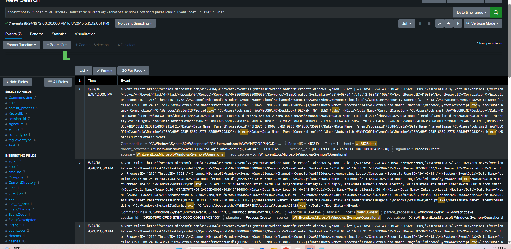

This only returned 7 events, and the third event appears to contain the script info we are looking for. Also the time of the event was 4:43:21.000 PM which lines up around when we would expect the initial infection to have occurred as it was about 32 mins before the encryptions were complete and about 5 mins before the host started to visit malicious sites.
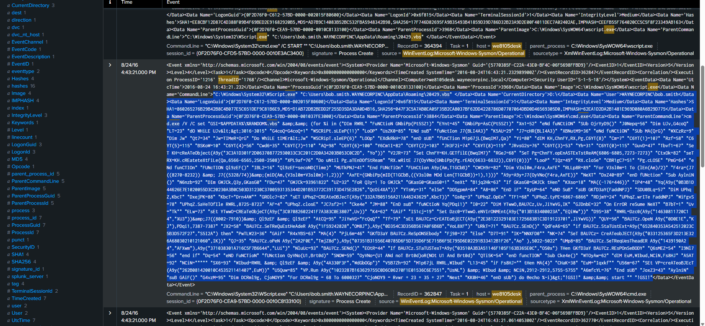

It looks like our field that we want to find the length of is `ParentCommandLine`, which makes complete sense that this is how the process was created. We see two similar events here both containing what looks to be similar vb scripts, but we want the one whose parent process is actually cmd.exe since that's where the process was started. Now that we have all of that sorted we can simply modify the query to find the length of the `ParentCommandLine` field and we get **4490 chars**.
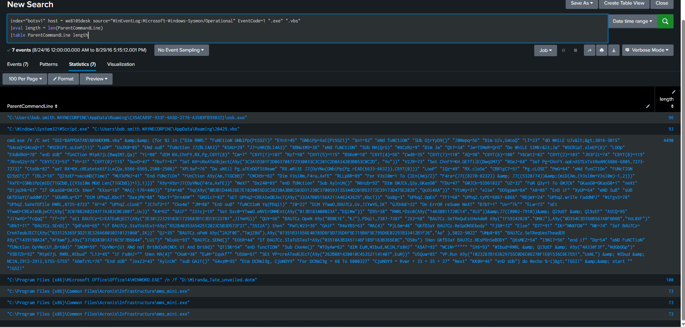

---
<br>

### Q6: What is the name of the USB key inserted by Bob Smith?

**Answer: `MIRANDA_PRI`**

For this one I first tried to find the name of the drive in an event from WinRegistry source, and then got more specific results when I included "USB" in my search as well. I sorted by time to see when the first USB related event from WinRegistry occurred. We can see here that the registrytype is "CreateKey". I figured the key that was created and associated could come in handy in tracking it. I found what I think is the key - it doesn't say explicitly but within both the field path and registry name path, we can see a process ID and some numbers/chars: `PID_6387#7D961196#{a5dcbf10-6530-11d2-901f-00c04fb951ed}`.
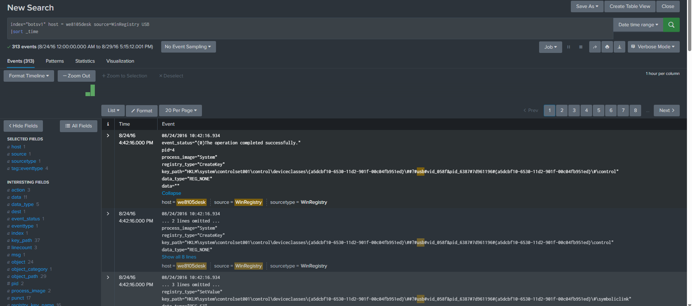

I noticed a field called `registry_key_name` and looked at the results — this caught my eye as it seems like it lists more about the USB itself in human readable form. I figured that sounds like it would list the USB name or get us closer, so added that to the query.
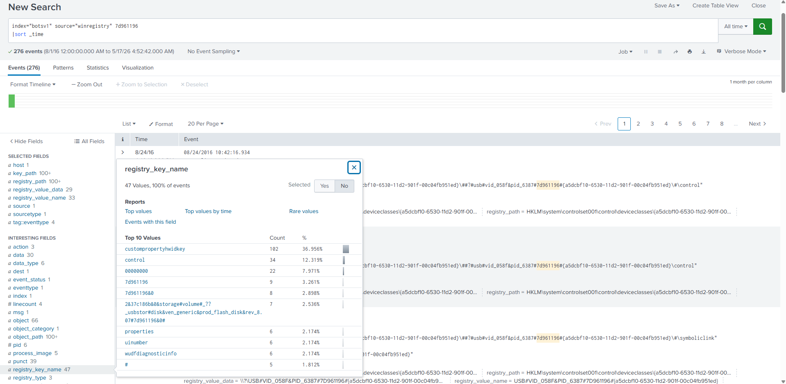

It only returned 7 results so I was able to go through each event, and in just the second event I can see that the "key_path" is in `\friendlyname` which sounds like it could mean human readable, and its data is `MIRANDA_PRI`. We know that the file that Bob initially opened at the start of the attack was called `Miranda_Tate_unveiled.dotm`, so it seems like this is it!
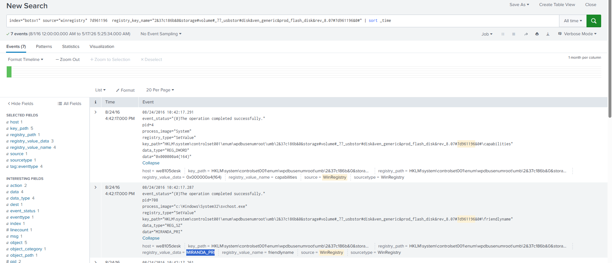

Removing the registry key name filter and adding MIRANDA_PRI to our query (to see more events related to it) we see another event with the process image of `/wudf.exe` (looked it up and this is a windows process that manages external drivers like USB and other external drives) with `registry_type="SetValue"` and also has MIRANDA_PRI as its data. That confirms it, and lines up perfectly timing-wise with the rest of the attack timeline/details.
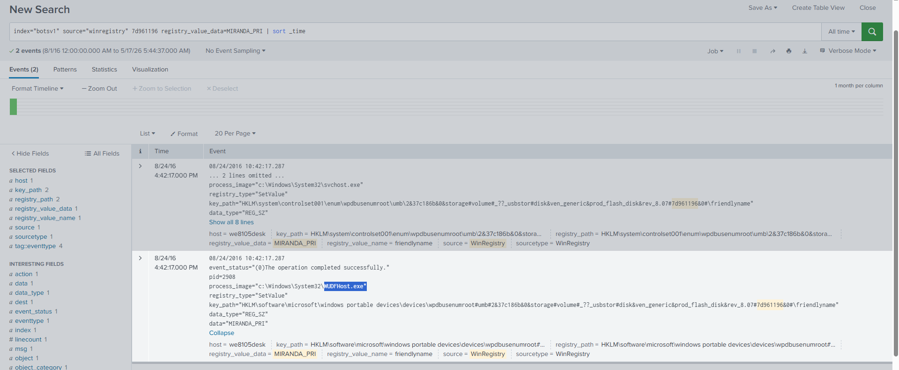

---
<br>

### Q7: Bob Smith's workstation (we8105desk) was connected to a file server during the ransomware outbreak. What is the IPv4 address of the file server?

**Answer: `192.168.250.20`**

For this one I know any file transfer would include ports 20, 21 (both ftp), 22 (sftp), 139 (NetBIOS - less likely), or 445 (SMB - more likely than NetBIOS), so I added all of them to my query as the dest_port with src_ip being bob's machine and changed the time to span between when the USB was plugged in and the end of the encryption phase.
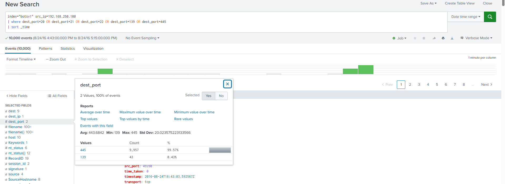

The events returned were only ports NetBIOS and SMB, and the only dest_IP was the one we earlier found to be assigned to the DNS server, but that makes sense since smaller businesses/networks often have the same machine for DNS/SMB and other services. DNS/SMB server IP = 192.168.250.20
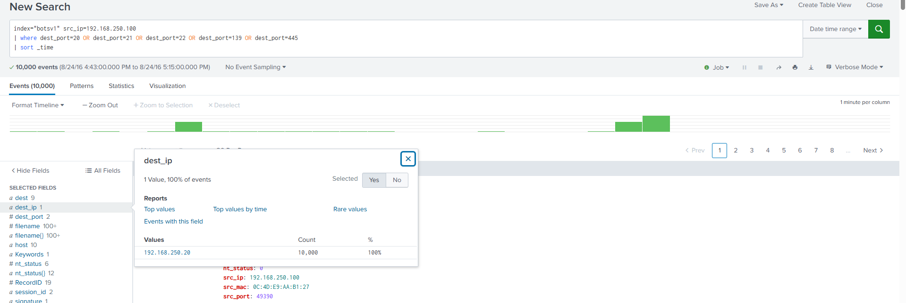

---
<br>

### Q8: How many distinct PDFs did the ransomware encrypt on the remote file server?

**Answer: `257`**

Now that I know the IP of the file server, I can find out the name of the machine in sysmon logs which we can see (and saw earlier with the DNS) is `we9041srv`. 
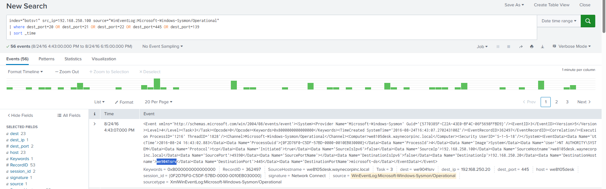

Realizing I don't need the alerts to be sysmon anymore, I now can remove that. I can also filter to that host to see the files changed on that actual device. Here we can see that all of the files have been granted to write and/or add data to files, so we can assume these are the ones encrypted.
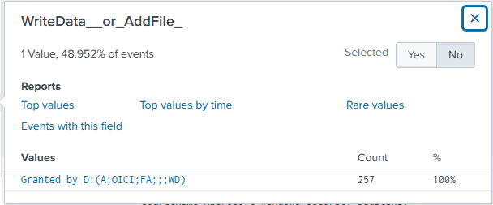

I can now just find the distinct counts of relative target names to find 257 unique files (since the same pdfs are involved in multiple events i.e. adds, edits, deletions).
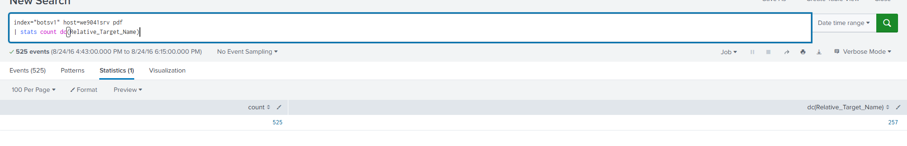

---
<br>

### Q9: The VBscript found in question 5 launches 121214.tmp. What is the ParentProcessId of this initial launch?

**Answer: `3968`**

For this one we know from #5 that the script that launches the 121214.tmp file is called Wscript.exe, so simply looking up these two in a query with Sysmon eventID=1 since it created a process, we can see the `ParentProcessID=3968`.
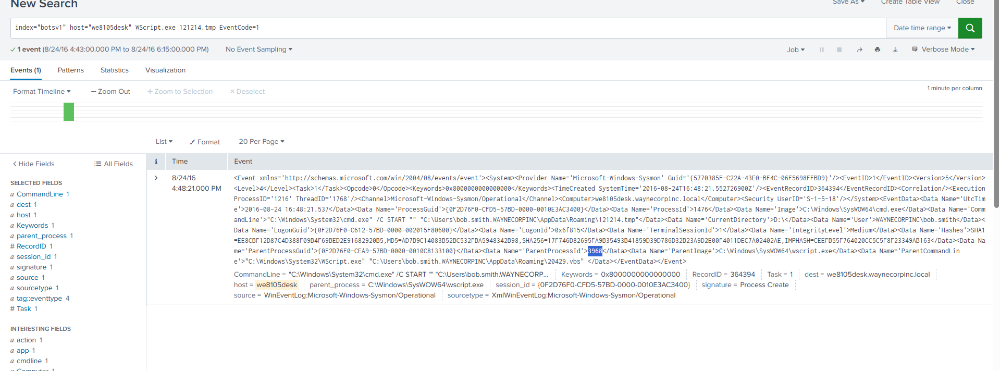

---
<br>

### Q10: The Cerber ransomware encrypts files located in Bob Smith's Windows profile. How many .txt files does it encrypt?

**Answer: `406`**

Using the same logic as #8, we just want to filter to see all .txt files associated with bob.smith account during the attack.
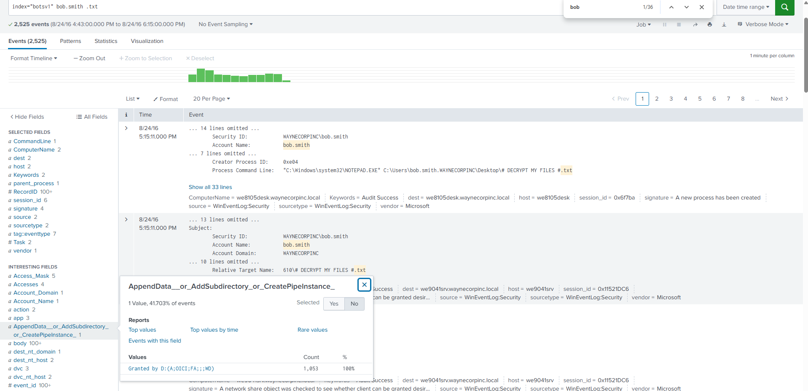

 We see that again these files were all granted access to be changed, unlike #8 though, there are two sourcetypes this time so we need to filter to just one, so we will go with Sysmon.
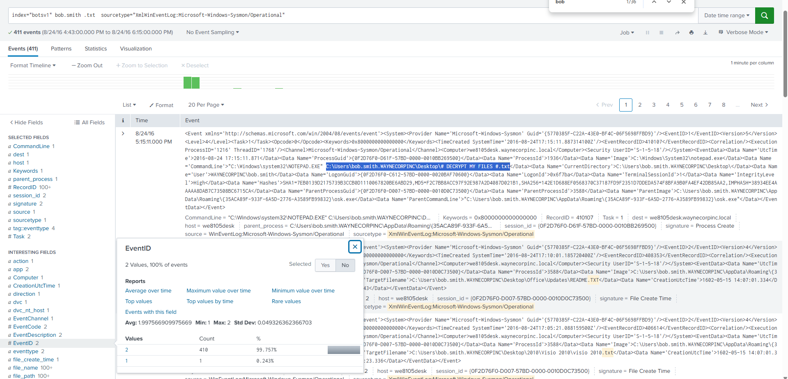

We can see all but one of these have eventcode 2 for a timestamp change (typical sign of attack), so these definitely seem like the .txt files we are looking for. Just to make sure it's under Bob's account I'll add his user's directory path to the query.
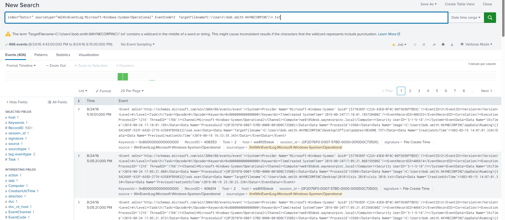

And to make sure there are no duplicates, we use `dc` and see there are indeed **406** different text files encrypted.
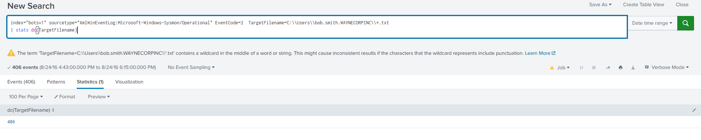

---
<br>

### Q11: The malware downloads a file that contains the Cerber ransomware cryptor code. What is the name of that file?

**Answer: `mhtr.jpg`**

For this one we know that Bob's machine would have to make a connection to download the file, and we know from #4 that the first malicious domain he visited was `solidaritedeproximite.org`, so that's a great place to start. With a quick query we can actually see that the download was included in the fortigate file we saw earlier: `mhtr.jpg`
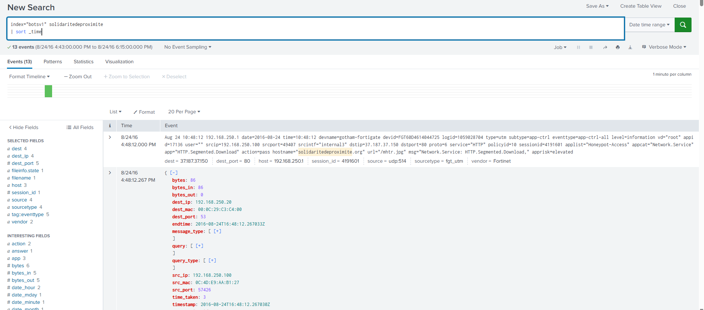

---
<br>

### Q12: Now that you know the name of the ransomware's encryptor file, what obfuscation technique does it likely use?

**Answer: Steganography - code inside an image file.**


---


